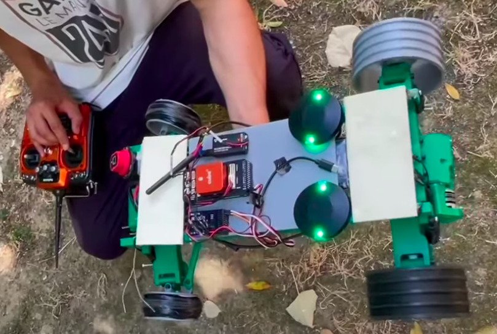
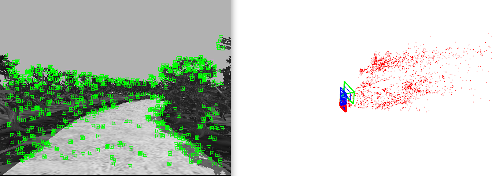

# Ardupilot_Rover

Otonom çapalama ve yapani otların tespit konumlandırma işlemi gerçekleştiren insansız kara aracımız Gökmen-PR

Hassas konumlandırma ve Toprak zemine uygun otonom RC aracımız:

Araç için ürettiğimiz yer kontrol istasyonumuz:

Aracımızın çevresini haritalamasını ve konumlandırmasını sağlamak için kullandığımız Visual Slam:

