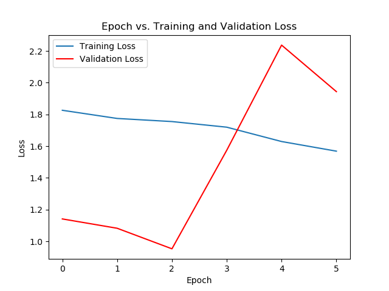

# Semantic_segmentation_with_SegNet
A repo for Segnet training from start to finish in two different ways

There are 4 different files here.

dataset.py, model.py, train.py, test.py

if you have a large dataset you can run train.py otherwise run pre_trainet.py

NOTE: The test part is designed for the drone in the gazebo simulation, if you want to use it with a webcam camera, you need to modify the test.py file.

NOTE2: You can view the training instantly using wandb, for this you can use the file pre_trained_wandb_integradet.py

